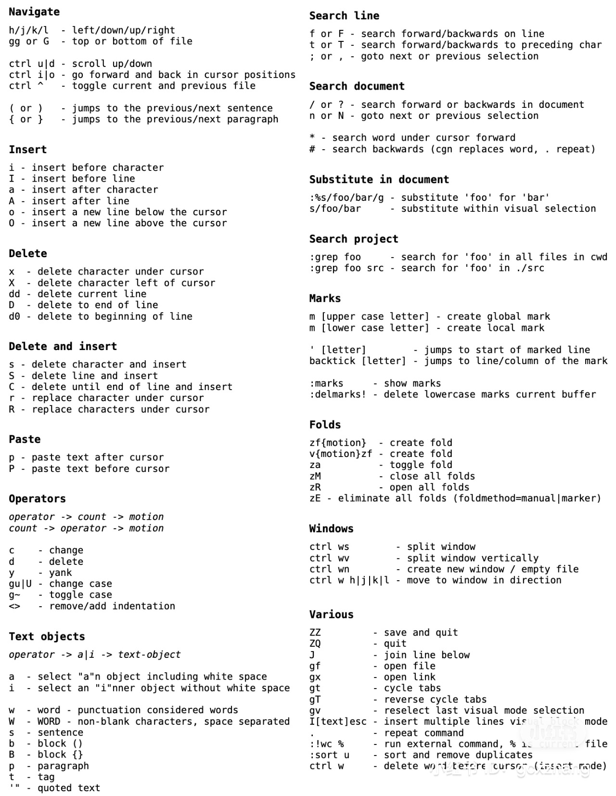

# VIM

## Env

Copy the `.vimrc` into the `$HOME` directory and restart `vim` application.

## Cheat Sheet

+ Copy the current line - `yy`
+ Undo - `u`, Redo - `Ctrl+r`
+ Select lines
  + `V` -> `number` -> `j/k`, e.g. `V4j`
+ Jump back to previous edit location
  + double backticks, i.e. \`\`
+ Jump to the matching parenthesis
  + `%`
+ Jump to the parenthesis from within a block
  + `[{` / `]}`, to opening / closing curly bracket
  + `[(` / `])`, to opening / closing parenthesis
+ Switch letter cases
  + select letters with `v` bindings
  + `gU` to upper case
  + `gu` to lower case
  + `g~` toggle case
+ Window controls
  + `ctrl + ww` cycle through all opened windows
  + `ctrl + w[h|j|k|l]` switch to left/down/up/right window
  + `ctrl + wv` open current file to a vertically split window
+ Tab controls
  + `gt` cycle through tabs
  + `gT` reversely cycle through tabs
  + `N gt` go to Nth tab, e.g. `1gt` go to first tab 
  

[Vim Cheat Sheet](https://vim.rtorr.com/)
